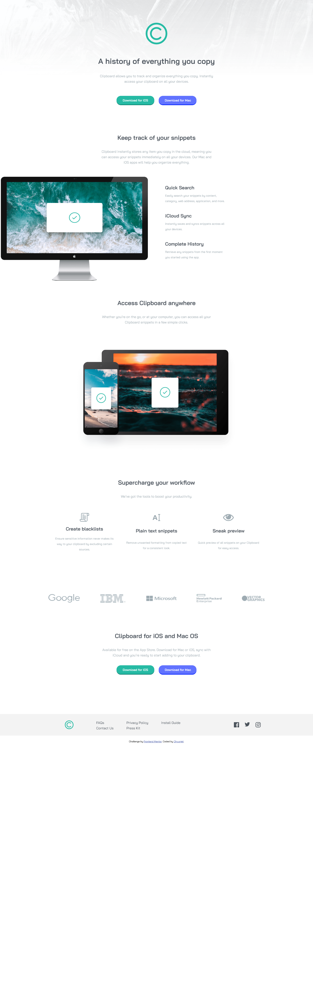

# Frontend Mentor - Clipboard landing page solution

This is a solution to the [Clipboard landing page challenge on Frontend Mentor](https://www.frontendmentor.io/challenges/clipboard-landing-page-5cc9bccd6c4c91111378ecb9). Frontend Mentor challenges help you improve your coding skills by building realistic projects. 

## Table of contents

- [Overview](#overview)
  - [The challenge](#the-challenge)
  - [Screenshot](#screenshot)
  - [Links](#links)
- [My process](#my-process)
  - [Built with](#built-with)
  - [What I learned](#what-i-learned)
  - [Continued development](#continued-development)
  - [Useful resources](#useful-resources)
- [Author](#author)
- [Acknowledgments](#acknowledgments)


## Overview

### The challenge

Users should be able to:

- View the optimal layout for the site depending on their device's screen size
- See hover states for all interactive elements on the page

### Screenshot




### Links

- Solution URL: [Add solution URL here](https://your-solution-url.com)
- Live Site URL: [Add live site URL here](https://your-live-site-url.com)

## My process

### Built with

- Semantic HTML5 markup
- CSS custom properties
- Flexbox
- filter (change the color of SVG file)
- class combination

**Note: These are just examples. Delete this note and replace the list above with your own choices**

### What I learned

Use this section to recap over some of your major learnings while working through this project. Writing these out and providing code samples of areas you want to highlight is a great way to reinforce your own knowledge.


```css
.icon:hover{
  filter:invert(66%) sepia(18%) saturate(1535%) hue-rotate(122deg) brightness(90%) contrast(89%);} 
/* it changes the color of SVG file */
```
```js

```

If you want more help with writing markdown, we'd recommend checking out [The Markdown Guide](https://www.markdownguide.org/) to learn more.


### Continued development

the readability of CSS. Eventhoght i used custom properties and combination of classes, but it sill look not readable enough. 
A new way on using CSS and HTML. I need more easier advance ways to use CSS and HTML other than what i am doing now (flex, grid, margin etc) to make a better webpage

### Useful resources

- (https://stackoverflow.com/questions/22252472/how-to-change-the-color-of-an-svg-element) - This helped me to change the color of SVG by adding filter on it.


## Author

- Frontend Mentor - [@Jetyun](https://www.frontendmentor.io/profile/Jetyun)


## Acknowledgments

Thanks to Dave Gray tutorials on CSS and HTML. 

Thanks to Elaine leung for her advice on media quary (need to make the multiple media quaries to make it clean in almost each size)
